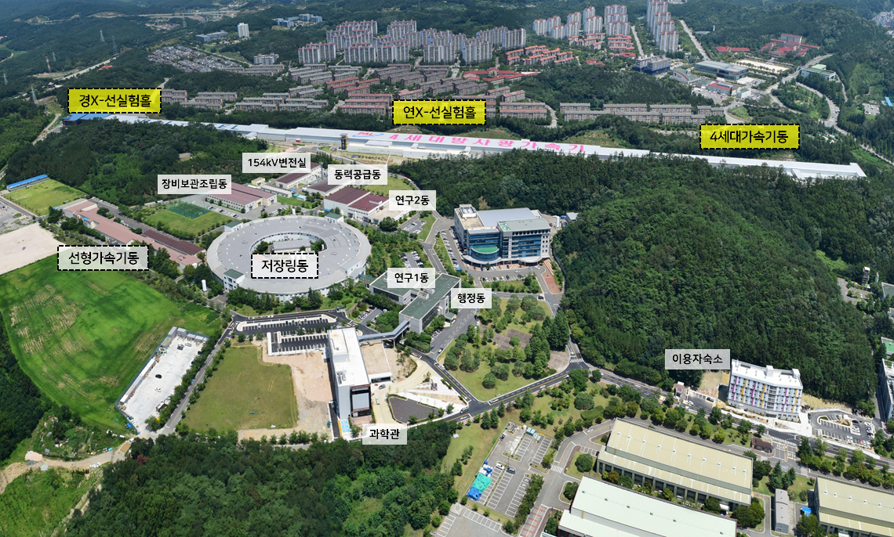

.. _PAL:
PAL (Pohang Accelerator Laboratory)
+++++++++++++++++++++++++++++++++++

.. raw:: html

     
    <h2>연구소 설립 목적</h2>
     
 포항가속기연구소는 방사광을 활용한 첨단 실험 기법의 개발과 실험 수행을 통해 우수한 연구 결과를 도출하고, 지속적인 첨단 가속장치 개발을 통해 한국의 기초과학과 산업 성장을 촉진하며, 더 나아가 인류의 삶의 질 향상과 전 세계적인 과학 발전에 기여하는 것을 목표로 합니다.
     

.. raw:: html

     
     
    <h2>연구소 건물 안내</h2>
     
 포항방사광가속기는 7년의 건설 기간을 거쳐 1994년 12월에 완공된, 21세기 한국 과학기술을 선도하는 중요한 첨단 연구시설입니다. 대지 면적은 126,800 ㎡로, 이는 축구 경기장 필드 약 85개에 해당하는 크기입니다. 건물 면적은 45,377 ㎡입니다. 주요 건물로는 전자를 빛의 속도로 가속하는 170 m 길이의 선형가속기, 전자를 원형으로 회전시키며 방사광을 발생시키는 둘레 281 m의 저장링, 그리고 발생된 방사광을 이용해 실험을 진행하는 빔라인이 있습니다.
     

.. raw:: html

     
     

.. toctree::

   PAL/PLS-II