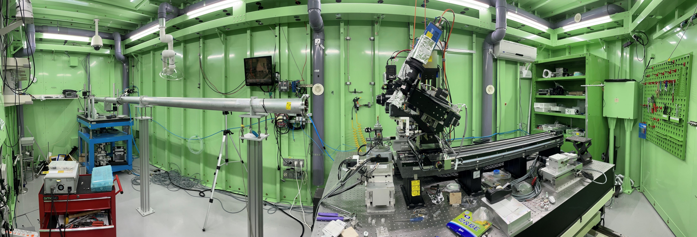

.. _6C BMI:
6C BMI
+++++++++++++++++++++

.. raw:: html

     
    <h2>포항 방사광 가속기</h2>
     
 Biomedical Imaging beamline (6C BMI)는 싱크로트론 방사선의 의학 응용 분야인 X선 영상 및 방사선 치료를 지원하며, 2013년 7월부터 이용자 서비스를 위해 운영되고 있습니다. 빔 특성과 계측기의 규모는 쥐, 토끼와 같은 작은 동물에 대한 실험에 적합합니다. 6C 빔라인에서는 다중 극 위글러(MPW)로부터 10-60 keV의 단색 X선을 제공하며, 샘플 평면 상의 최대 조사 크기는 8 cm x 3 cm입니다. 실험 허치의 기본 설정으로는 X선 흡수/위상 대조 투사 영상 및 이를 확장한 컴퓨터 단층 촬영이 가능합니다. 시야 영역(FoV)과 이미지 해상도는 사용되는 X선 검출기에 의해 결정됩니다. 이 빔라인은 7 cm x 7 cm, 6 cm x 4 cm 및 7 mm x 5 mm 미만의 FoV를 갖는 다양한 X선 검출기로 장착되어 있습니다. 해당 해상도는 각각 48, 32, 1-5 마이크론입니다. 빔타임 동안 사용 가능한 연구 목적의 동물 실험실이 있으며, 번식/성장이 가능하도록 항온항습의 환경과 공조 시스템이 제공됩니다. 이산화탄소 인큐베이터, 클린 벤치 및 관련 장비를 설치 중이며, 세포 및 조직 수준 실험이 가능한 수준으로 업그레이드 중에 있습니다.
     

     
 6C 빔라인은 의학 연구외에도 X선 영상 연구에 적합한 모든 샘플에 적용할 수 있습니다. 실험 허치의 크기는 2 m x 8 m 이며, 사용자들을 위해 실험 허치 내부의 광학 테이블에 실험 셋업을 수정 및 변경하여 최적화 할 수 있습니다. (실험 허치 바로 앞의 광학 허치 내부에는 원하지 않는 산란을 차단하기 위해 X선 광학 요소를 배치할 수 있는 1 m 길이의 여유 공간이 필요합니다.)
     

