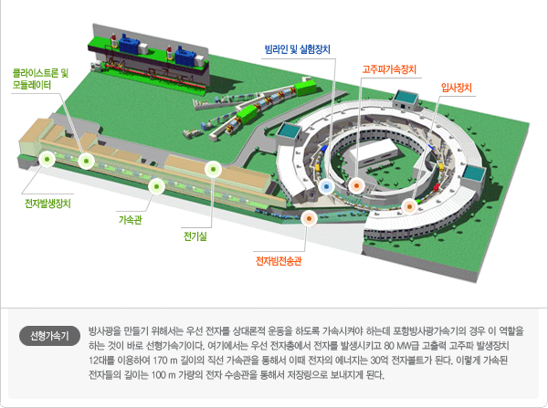

.. _PLS-II:
PLS-II
++++++++++++++++

.. raw:: html

     
    <h2>포항 방사광 가속기</h2>
     
 빛은 다양한 용도로 활용되기 때문에 광원 개발은 매우 중요합니다. 기존의 광원은 빛의 세기가 약하고 원하는 파장을 선택하기 어렵다는 단점이 있습니다. 그래서 수 백만배에서 수 억배에 이르는 강력한 빛을 만들어내는 것이 바로 인공적인 빛인 방사광입니다. 방사광은 적외선부터 우리가 눈으로 볼 수 있는 가시광선, 그리고 자외선, X-선까지 다양한 영역에 걸쳐있는 광원입니다. 이러한 방사광을 만들어내는 장치를 방사광가속기라고 합니다.
     

     
 Pohang Light Source (PLS)는 2009년부터 2011년까지 3년 동안 PLS-II로 업그레이드되었습니다. 전자 빔 에너지는 2.5 GeV에서 3 GeV로 증가하고, 빔 전류는 170 mA에서 400 mA로 상승했습니다. 격자 구조는 더블밴드로 변경되었으며, 방호벽은 그대로 유지되었습니다. 삽입장치(ID)를 위한 직선 구간 수는 10개에서 20개로 증가했습니다. LINAC과 RF 캐비티로부터의 주입은 3개의 긴 직선 구간을 차지합니다. 링의 emittance 는 18.9 nmrad에서 5.8 nmrad로 감소했습니다.
     

.. toctree::

   6C BMI